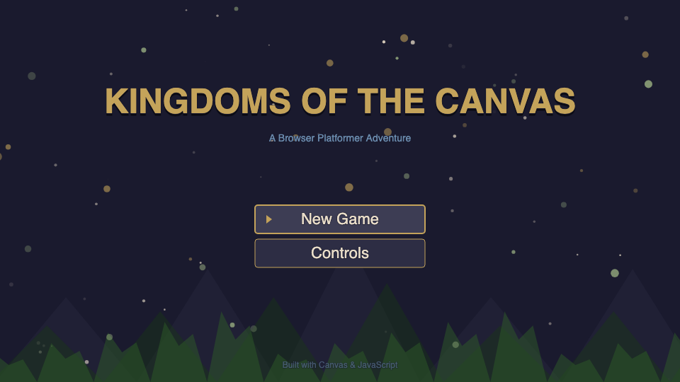
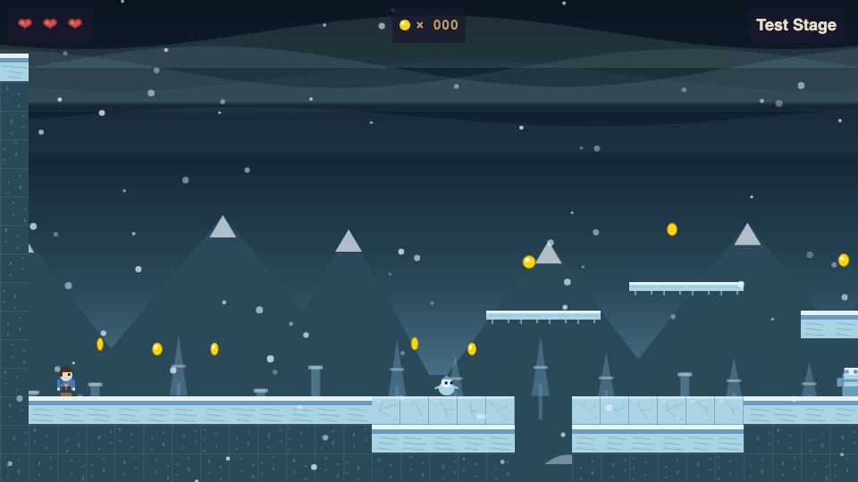
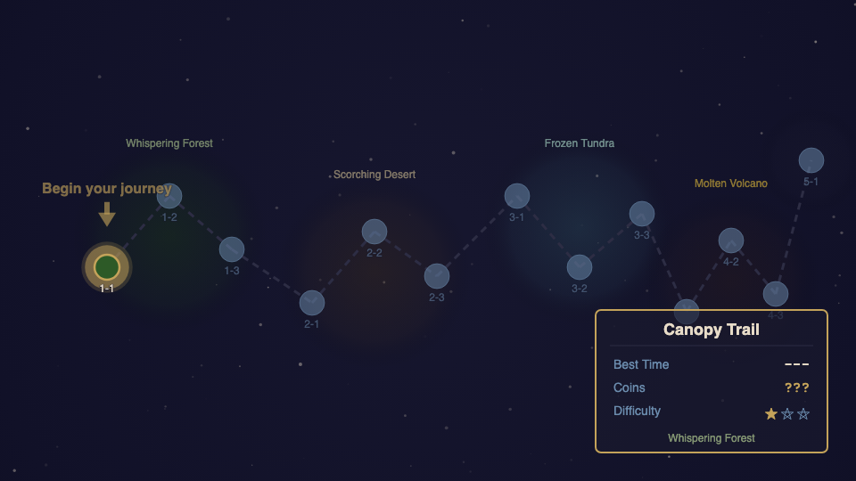

# Kingdoms of the Canvas

A fully browser-based 2D side-scrolling platformer built entirely with vanilla JavaScript and HTML5 Canvas. No game engine, no external assets, no server component -- every sprite, tile, background, and sound is generated programmatically through Canvas drawing commands and the Web Audio API.



## Overview

Kingdoms of the Canvas delivers a complete platforming experience across **4 themed worlds** with **12 stages**, **13 unique boss fights**, puzzles, collectibles, and a climactic final confrontation -- all running at 60fps in a single browser tab with zero dependencies.

The game proves that the modern browser is a legitimate game platform, capable of delivering real game feel -- coyote time, jump buffering, wall slides, screen shake, particle effects -- without a single external file.



## Features

### Player Movement
- Walk and run (hold Shift for 1.6x speed)
- Variable-height jumping (hold for higher)
- Wall slide and wall jump
- Coyote time (6-frame grace period after leaving a ledge)
- Jump buffering (8 frames before landing)
- Crouch and crouch-slide
- Melee attack, charge attack (hold to break blocks), and jump attack (pogo bounce off enemies)

### Worlds & Stages

| World | Theme | Stages | Unique Mechanics |
|-------|-------|--------|-----------------|
| **Whispering Forest** | Green canopy, wooden platforms, mushrooms | Canopy Trail, Hollow Depths, Treetop Gauntlet | Breakable blocks, bounce pads, crumbling platforms |
| **Scorching Desert** | Sand dunes, cacti, ancient ruins | Dune Sea, Buried Temple, Oasis Mirage | Quicksand, dark rooms with mirrors, water/swimming |
| **Frozen Tundra** | Ice caverns, aurora borealis, snowfall | Frozen Lake, Crystal Caverns, Avalanche Peak | Ice physics (reduced friction), auto-scrolling |
| **Molten Volcano** | Dark stone, glowing lava, embers | Lava Fields, Forge of Chains, Caldera | Rising lava, chain-swinging, steam vents |
| **The Citadel** | All themes remixed | Final stage | All mechanics combined, 5-phase final boss |

### Boss Fights
Each world features 3 unique bosses with distinct attack patterns, phase transitions, and vulnerability windows. The final boss "The Architect" spans 5 phases (one for each world theme) requiring 19 total hits to defeat.

### Enemies
12+ enemy types with unique AI behaviors, each thematically tied to their world:
- **Forest**: Shroomba (patrol), Thorn Vine (stationary shooter), Bark Beetle (ceiling walker)
- **Desert**: Sand Skitter (charge), Dust Devil (invincible pusher), Mummy (revives once)
- **Tundra**: Frost Imp (snowball arcs), Ice Golem (slides on ice), Snow Owl (swooping flight)
- **Volcano**: Magma Slime (splits on death), Fire Bat (erratic groups), Obsidian Knight (shielded)

### World Map


Top-down navigable world map with 4 world clusters connected by paths. Completed stages show checkmarks, locked stages are grayed out, and an info panel displays stage name, best time, coins collected, and difficulty rating.

### Audio
Fully synthesized audio via the Web Audio API -- no audio files:
- Player sound effects (jump, land, attack, hurt)
- Enemy and boss audio cues
- Per-world ambient soundscapes (forest wind, desert drone, tundra howl, volcano rumble)
- Dynamic boss music with procedural percussion that speeds up as boss health decreases
- Volume control and mute toggle

### Visual Effects
- Parallax scrolling backgrounds (3+ layers per world)
- Particle systems: dust on landing, sparks on wall slide, snow, embers, leaves
- Screen shake on impacts and boss hits
- Hit flash on damage
- Death animation (sprite breaks into pieces)
- Boss defeat slow-motion effect with particle explosion
- Iris-wipe screen transitions

### Persistence
Progress is saved to `localStorage` after each stage completion:
- Completed stages and best times
- Coin totals per stage
- Lives remaining
- Power Stars collected

## Controls

| Key | Action |
|-----|--------|
| Arrow Keys | Move / Navigate menus |
| Z | Jump |
| X | Attack |
| Shift | Run (hold) |
| Down Arrow | Crouch |
| Enter | Confirm / Start |
| Escape | Pause |

## Getting Started

### Prerequisites
- A modern web browser (Chrome, Firefox, Safari, or Edge)
- A local HTTP server (the game uses script tags and must be served over HTTP)

### Running the Game

1. **Clone the repository:**
   ```bash
   git clone <repository-url>
   cd platform-game
   ```

2. **Start a local server:**
   ```bash
   python3 -m http.server 8080
   ```
   Or use any static file server of your choice (e.g., `npx serve`, VS Code Live Server, etc.)

3. **Open in your browser:**
   ```
   http://localhost:8080
   ```

That's it. No build step, no `npm install`, no bundling required.

### Building / Deployment

There is no build step. The game is pure static files. To deploy, copy `index.html` and the `src/` directory to any static hosting service (GitHub Pages, Netlify, Vercel, S3, etc.).

## Tech Stack

| Layer | Technology |
|-------|-----------|
| Language | Vanilla JavaScript (ES6+) |
| Rendering | HTML5 Canvas 2D API |
| Audio | Web Audio API (OscillatorNode, GainNode, BiquadFilterNode) |
| Persistence | localStorage |
| Resolution | 960x540 logical pixels, scaled to fit window |
| Dependencies | **None** |

## Project Structure

```
platform-game/
├── index.html              # Entry point - canvas setup, CSS scaling, module loading
└── src/
    ├── constants.js        # Game constants, tile IDs, physics values, color palettes
    ├── input.js            # Keyboard input handler with press-queue detection
    ├── level.js            # Level data, tile maps, moving platforms for all stages
    ├── physics.js          # AABB collision, gravity, terminal velocity, one-way platforms
    ├── camera.js           # Smooth follow, vertical dead zone, parallax layer generation
    ├── renderer.js         # Canvas drawing: parallax backgrounds, tiles, platforms, entities
    ├── particles.js        # Particle system: dust, sparks, embers, snow, leaves, explosions
    ├── player.js           # Player entity: movement, combat, damage, animation states
    ├── enemies.js          # Enemy AI framework, boss fights, all enemy/boss types
    ├── transition.js       # Screen transitions (iris-wipe effects)
    ├── hud.js              # Heads-up display: health hearts, coin counter, boss health bar
    ├── menu.js             # Title screen, pause menu, controls screen, game over/victory
    ├── save.js             # localStorage save/load system
    ├── collectibles.js     # Coins, health pickups, extra lives, Power Stars
    ├── worldmap.js         # World map navigation, stage selection, progression tracking
    ├── audio.js            # Web Audio API synthesizer, sound effects, ambient loops
    ├── states.js           # Game state machine (TITLE, WORLD_MAP, STAGE, BOSS, etc.)
    └── game.js             # Main game loop (fixed-timestep), initialization, debug API
```

### Architecture

The game follows an **entity-component-style** architecture where game objects are plain data and systems operate on them:

- **Game Loop** (`game.js`): Fixed-timestep loop running at 60 updates/second with delta-time interpolation for smooth rendering.
- **State Machine** (`states.js`): Manages game flow -- TITLE, WORLD_MAP, STAGE, PAUSED, BOSS, STAGE_COMPLETE, GAME_OVER, VICTORY -- with clean transitions.
- **Physics** (`physics.js`): AABB collision detection against the tile map. Handles gravity, friction, one-way platforms, and moving platforms.
- **Camera** (`camera.js`): Smooth horizontal follow with a vertical dead zone. Generates multi-layer parallax backgrounds per world theme.
- **Renderer** (`renderer.js`): All drawing uses Canvas 2D primitives (rectangles, arcs, lines). Every visual in the game is procedurally generated -- no sprite sheets or image files.

## Design Philosophy

**"Depth through constraint."** By eliminating external assets, every visual and audio element is deliberately crafted in code. This produces a distinctive aesthetic -- geometric, bold, procedural -- that sets the game apart from sprite-sheet platformers. The visual style is built on bold geometric shapes rendered in rich, saturated palettes, like an architect's sketch brought to life.

## License

See [LICENSE](LICENSE) for details.
